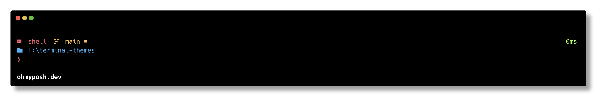

# Terminal Themes

Custom themes to enhance your terminal’s look and feel.

## 🚀 Installation

### Prerequisites
- [Oh My Posh](https://ohmyposh.dev)
- [Nerd Font](https://www.nerdfonts.com/font-downloads)

### Setup
1. Download your preferred `.omp.yaml` theme.
2. Set it in your shell config. For example, in **Bash**:

   ```bash
   eval "$(oh-my-posh init bash --config /path/to/theme.omp.yaml)"
   ```
3. Reload your shell:

   ```bash
   source ~/.bashrc
   ```

> For other shells, see the [Oh My Posh docs](https://ohmyposh.dev/docs/installation/prompt).

## 🎨 Theme Preview

### `emodipt-custom`


## 🔗 Links
- [Oh My Posh](https://ohmyposh.dev)
- [Nerd Fonts](https://www.nerdfonts.com/font-downloads)
