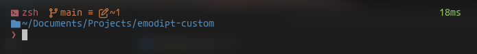

# emodipt-custom



A custom theme for **Oh My Posh**, edited from the `emodipt-extend` theme to enhance the terminal's appearance and functionality.

## Installation

### Prerequisites
1. **Oh My Posh**: Make sure you have [Oh My Posh](https://github.com/JanDeDobbeleer/oh-my-posh) installed.

2. **Nerd Fonts**: The theme requires a Nerd Font to render icons properly. Install a [Nerd Font](https://www.nerdfonts.com/font-downloads).

### Setting Up
1. Clone the repository:
   ```bash
   git clone https://github.com/kuro1kag3/emodipt-custom.git
   ```
2. Set the theme in your shell configuration. For example, for **Bash**, you can add this to your `.bashrc`:
   ```bash
   eval "$(oh-my-posh init bash --config /path-to-this-repo/emodipt-custom.omp.json)"
   ```
3. Restart your terminal or source the configuration:
   ```bash
   source ~/.zshrc
   ```

## Customizations
Feel free to modify the theme to suit your preferences. The theme is based on `emodipt-extend`, which gives a vibrant and colorful experience, with the following customizations:
- Altered segment colors.
- Font and icon tweaks.
- Enhanced segment visibility for a cleaner experience.

## Links
- [Oh My Posh](https://github.com/JanDeDobbeleer/oh-my-posh)
- [Nerd Fonts](https://www.nerdfonts.com/font-downloads)
